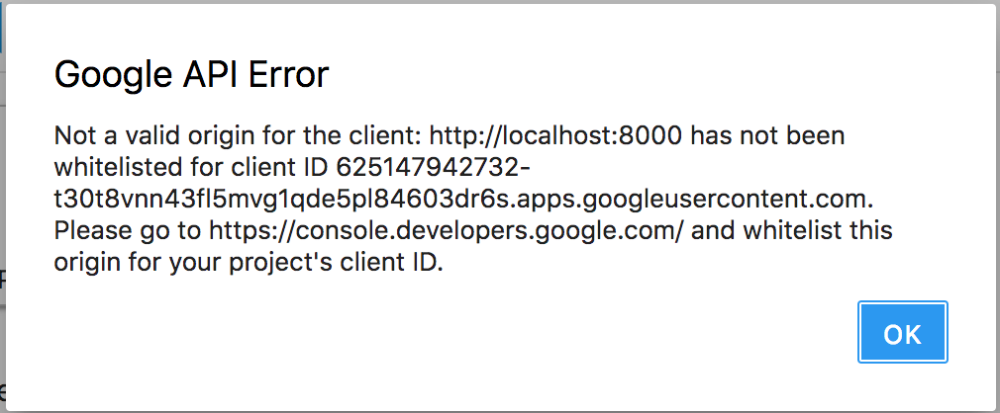

# Background
This code base to deploy Jupyter Notebooks using JupyterHub is based on the reference implementation from https://github.com/jupyterhub/jupyterhub-deploy-docker.

# Installation Guide

## Install Docker and Docker Compose

* Install Docker: https://docs.docker.com/install/
* Install Docker Compose: https://docs.docker.com/compose/install/

## Create secrets directory
Type the following on your Linux command line:
> `$ mkdir secrets`
> `$ pwd`

You will copy the result of `pwd` later to your `letsencrypt-certs.sh` file.

## Create `.env` and `userlist` files
There are two template files for `.env` and `userlist`, `.env-template` and `userlist-template`. Rename these files by removing the `-template` suffix. These are the only two files you need to update.

## Obtain Domain name
If you intend to use JupyterHub on your laptop for localhost use, there is no need to obtain a domain name and you can skip this step. If JuypterHub will be used with a domain name, obtain domain name.

## Create SSL Certificate (two options)
### Self-signed certificate
Using a self-signed certificate is useful for testing or limited use (localhost).
> `$ chmod +x create-certs.sh`
> `$ ./create-certs.sh`

### Obtain "Lets Encrypt" SSL Certificate
If using JupyterHub with a domain name, open the `letsencrypt-certs.sh` bash script with a text editor (e.g., nano) and edit the first few lines (lines 3, 4 and 5):

* For the line below, replace "mydomain.com" with your domain name, "e.g., example.com"
> `export JH_FQDN="mydomain.com"`
* For the line below, replace email address with your email address
> `export JH_EMAIL="myname@mydomain.com"`
* For the line below, replace "/path/to" with full path (result of `pwd` earlier)
> `export JH_SECRETS="/path/to/secrets"`

> `$ chmod +x letsencrypt-certs.sh`
> `$ ./letsencrypt-certs.sh`

## JupyterHub Authentication

This build of JupyterHub has three options for Authentication. Go to about Line 18 of the `.env` file and set the environment variable `JUPYTERHUB_AUTHENTICATOR` to the selected option.
* tmp_authenticator
* dummy_authenticator (default)
* github_authenticator (thru OAuth, requires obtaining GitHub credentials, see below)

## Obtain your GitHub Account Credentials
If you will be using GitHub Oauth to authenticate users to JupyterHub, you need to sign up for a GitHub Account. Open the file `userlist` with your text editor and add your GitHub user name below "jovyan admin" as below:
> `<github username> admin`

## Obtain GitHub OAuth Credentials
* Log in to GitHub
* Go to Developer Settings (https://github.com/settings/developers) - create new Oauth App
* Record the following information:
  * GitHub Client ID
  * GitHub Client Secret
  * GitHub Callback URL: This should be of the form https://mydomain.com/hub/oauth_callback if with a domain name (remember to replace "mydomain.com" with your domain name, as obtained from the step above.)
* Copy these to right `.env` section:

> `GITHUB_CLIENT_ID=<github client id>`
> `GITHUB_CLIENT_SECRET=<github client secret>`
> `OAUTH_CALLBACK_URL=https://mydomain.com/hub/oauth_callback`

If using localhost, replace "mydomain.com" in OAUTH_CALLBACK with "localhost" (i.e., "https://localhost/hub/oauth_callback").

## Generate Postgres password
This JupyterHub deployment uses the PostgreSQL database as a backend (instead of sqlite).
* Create the postgres password by typing the Linux command below:
> `$ openssl rand -hex 32`
* Copy the result of the command to the right `.env` section by replacing the `geeks@localhost` entry with the cryptic, "hex" value:
> `POSTGRES_PASSWORD=geeks@localhost`
> `JPY_PSQL_PASSWORD=geeks@localhost`

## Create Docker networks and volumes
Type the following Linux commands on the command line:
> `$ make network`
> `$ make volumes`

## Build the Notebook Server Docker Image
Type the following command on the command line:
> `$ make notebook_image`

## Build the PostgreSQL 9.5 and JupyterHub Docker images
Type the following command on the command line:
> `$ ./buildhub.sh`

This script does two things:
* Obtains the internal Docker network IP of the JupyterHub container.
* Builds the final JupyterHub and Postgres DB images

## Launch JupyterHub and Browse Your Brand New Notebook Server
* To troubleshoot potential issues during first launch, use the following command:
> `$ ./starthub.sh`

This script launches both JupyterHub and Postgres DB backend in the background and launches log monitoring.

* If localhost, go to https://localhost in your browser. If using a domain name, go to https://mydomain.com.
* Sign in to GitHub using your account

Due to unconfigured Google Drive Integration, you will see something like this error message pop up after launching Jupyterlab. Just click "OK". You can configure Google Drive integration later.

Please see next section for instructions on how to configure Google Drive to work with your JupyterLab set up.

# Jupyterlab Google Drive Integration
* Please follow the instructions here:
https://github.com/jupyterlab/jupyterlab-google-drive/blob/master/docs/advanced.md

# Summary
In summary, there are a few steps to get started with Jupyter Notebooks:

1. Decide whether to run as `localhost` or with domain name. (Best to try out `localhost` first.)

  a. If `localhost`, run `create-certs.sh` script.
  b. If with domain name: obtain domain name, run `letsencrypt-certs.sh` script.

2. Configure the `.env` and `userlist` files accordingly.
3. Run `buildhub.sh` script.
4. Run `starthub.sh` script.

# Upgrading from JupyterHub 0.7* to 0.8*
Delete the old `jupyterhub_cookie_secret` file:
> `$ sudo rm /var/lib/docker/volumes/jupyterhub-data/_data/jupyterhub_cookie_secret`

# JupyterHub Logs / Launch Issues
## Logs: Old base64 cookie-secret detected in /data/jupyterhub_cookie_secret.
* While jupyterhub is running, type the following commands:
> `$ docker exec -it jupyterhub /bin/bash`
* This brings you to the jupyterhub bash prompt. Type the following command to regenerate a new cookie secret:
> `# openssl rand -hex 32 > "/data/jupyterhub_cookie_secret"`
## Browser: 403 : Forbidden
* Add your GitHub username to the `userlist` file as described above.
