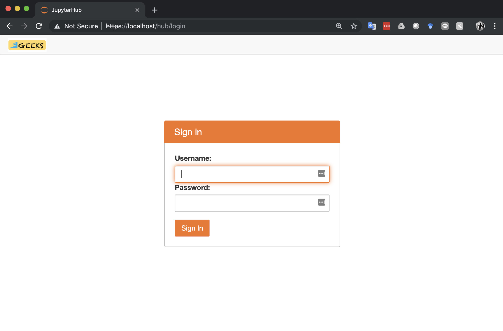
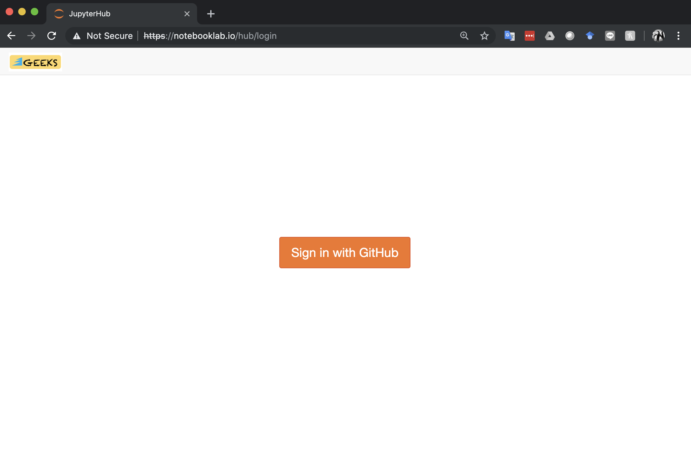
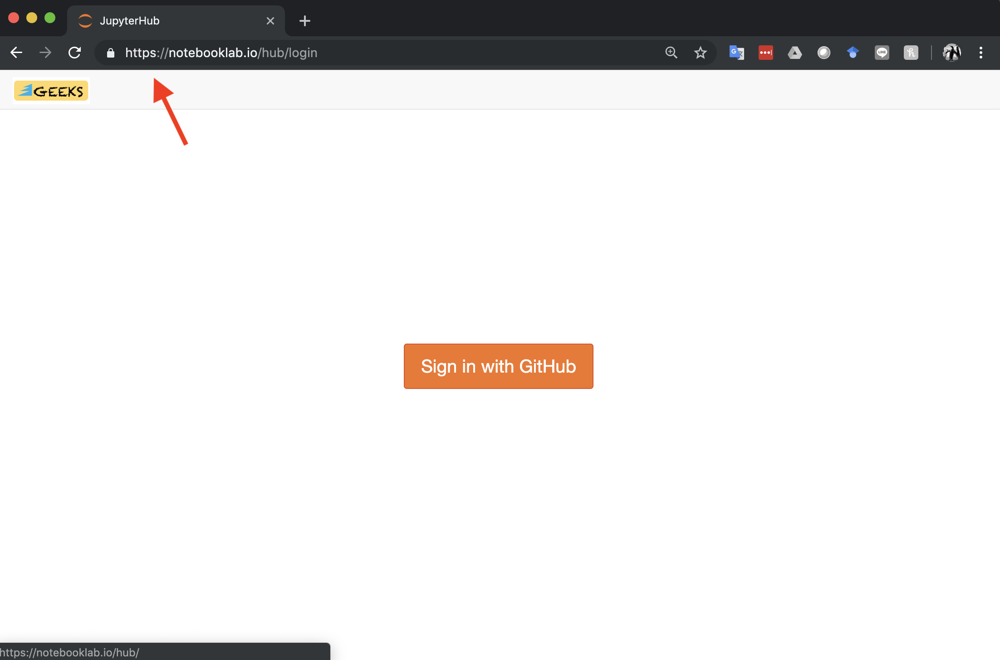
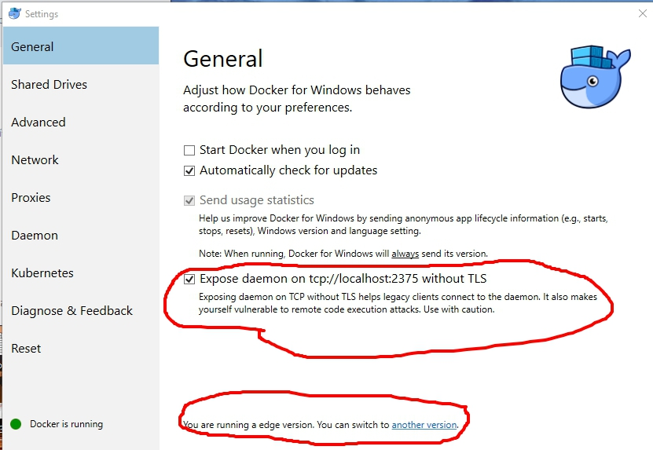

# Background
This code base to deploy Jupyter Notebooks using JupyterHub is based on the open source reference implementation from https://github.com/jupyterhub/jupyterhub-deploy-docker.

It also uses Docker (https://www.docker.com/) containers to manage the three pieces of software needed to run this set up:
1. JupyterHub - takes care of authentication and spawning of single-user notebook servers (containers)
2. Jupyter Notebooks - notebook environment with Python 3.6 kernel
3. PostgreSQL or SQLite database backend to store notebook user data

# Installation Guide - Quick

## First install on localhost machine
1. Install `Docker`, `docker-compose`, `git`. (...or run  `sudo install-docker-bionic.sh` - be sure to change `$INSTALL_USER` variable to your local username.)
2. Open terminal app and `cd` to preferred workspace directory
3. `git clone` this repository: `git clone https://github.com/PHI-Toolkit/jupyterhub-deploy-docker-localhost.git`
4. `cd jupyterhub-deploy-docker-localhost`, locate buildhub.sh, make sure it is executable and run this script on command line.
5. Wait for the `buildhub.sh` script to finish, watch for build errors. Then locate `starthub.sh`, make sure it is executable, then run `./starthub.sh` on a terminal. You will see container logs being displayed as the containers start up. Before running `./starthub.sh` you may want to check:
    5.1 Built Docker contaiiners: run `docker images` on the terminal.
    5.2 Running containers (after running `./starthub.sh`: run `docker ps` on the terminal.
6. Open Chrome, Chrome-based Edge, Safari, or Firefox browser and proceed to https://localhost. (Look up default login credentials on .env file.)

### Changing the UI to JupyterLab

You can easily switch to the JupyterLab user interface:
1. Temporarily by editing the URL, and replacing `tree` with `lab`.
2. Permanently by switching the `.env` file entry `JUPYTER_UI=notebook` with `JUPYTER_UI=/lab` (slash is important).

## First install on remote server

Follow steps 1-6 above and replace localhost with IP address of remote server. See also **Four Steps** below. If you get a `NET::ERR_CERT_INVALID` error on Chrome, use Firefox instead or see this [Stack Overflow solution](https://stackoverflow.com/questions/7580508/getting-chrome-to-accept-self-signed-localhost-certificate) for Chrome.

## Modifying the `.env` and `userlist` files

The `.env` is automatically created after the first run of the `buildhub.sh` script. It contains configurable parameters for this application, including:
1. Authentication - includes `dummy_authenticator` (default), `github_authenticator`
2. SSL Certificate - self-signed (default) or LetsEncrypt
3. Database for user data - SQLite or PostGreSQL
4. Custom logo (filename pointer to image)
5. Jupyter Notebook UI or JupyterLab
6. Versions of JupyterHub, JupyterLab, Jupyter Notebook, and PostGRESQL Hub backend
7. OAuth, Notebook and Hub, PostGreSQL Authentication Credentials
8. Single-user Notebook server timeout (when idle servers are culled)

The `userlist` file is automatically created from `userlist-template` after the first run of the `buildhub.sh` script. For GitHub autentication, follow the template entry for recording GitHub username in the `userlist` file and assigning `admin` status. This can also be done through the `Admin` interface of JupyterHub.

## Starting and Stopping Containers
1. `cd` to the folder where you did `git clone` of the GitHub repository. (This is important to do before running any of the shell scripts below.)
2. To start containers, run `./starthub.sh`. Running this script also displays the logs for the running containers as they boot up and/or encounter any launch errors.
3. To stop containers, press `ctrl-C` if you see log file display on your terminal. When you see the terminal prompt, run `./stophub.sh`.
4. You can also use `./restarthub.sh` for stopping and restarting containers.

## Recommended four steps for remote server install (unmodified `.env` file to full LetsEncrypt SSL certificate)

### Step 1
Follow steps for first install (step 1-6, unmodified `.env` file after `git clone`) then test if the JupyterHub server can be accessed at `https://<server IP address>` using a Chrome or Firefox browser. First install uses default settings - dummy_authenticator, self-signed SSL certificates for running on `localhost` machine. The `localhost` IP address can be replaced with the server IP address.

**Figure 1**. JupyterHub signin page using `dummy_authenticator` and self-signed SSL certificate

### Step 2
Obtain a domain name and assign it to the JupyterHub server IP address. Test if the JupyterHub server can be accessed through the fully qualified domain name (FQDN) using `https`. Test the domain name by running `./restarthub.sh` at the terminal after exiting from logs display with `ctrl-C`.

### Step 3
Obtain GitHub OAuth credentials and record these in the `.env` file (around line 67), replacing the `GITHUB_CLIENT_ID`, `GITHUB_CLIENT_SECRET` and `GITHUB_CALLBACK_URL` with the correct entries from GitHub. In the `.env` file (around line 37) make sure you replace `JUPYTERHUB_AUTHENTICATOR=dummy_authenticator` with this entry, `JUPYTERHUB_AUTHENTICATOR=github_authenticator`. For high volume access, make sure you also obtain an access token from `https://help.github.com/articles/creating-a-personal-access-token-for-the-command-line/` and record the access token using the `.env` file `GITHUB_ACCESS_TOKEN` environment variable (around line 73). Other important edits to do at this step:
1. Make sure you add your GitHub username to the `userlist` file as described above, especially if you see the `403 : Forbidden` error in your browser.
2. Run `docker-compose build hub` to include the revised `userlist` file in the JupyterHub container. If you have already selected `use_ssl_le` in the `.env` file, run `docker-compose -f docker-compose-letsencrypt.yml build hub` instead.
3. Test GitHub OAuth by restarting the containers using `./restarthub.sh`. The display should be similar to Figure 2 below.

**Figure 2**. JupyterHub sign in page after launching containers.

### Step 4
To replace the self-signed SSL certificate with LetsEncrypt certificates, replace the `.env` file entry `JUPYTERHUB_SSL=use_ssl_ss` with `JUPYTERHUB_SSL=use_ssl_le` (around line 86), as well as the `JH_FQDN`, `JH_EMAIL` and `CERT_SERVER` variables in the `.env` file (around line 92). Leave `CERT_SERVER` blank for production. Then run `./restarthub.sh` on a terminal. The browser display should be similar to Figure 3 below.

**Figure 3**. JupyterHub sign in page with LetsEncrypt SSL certificate installed.

# Installation Guide - Some Details for Remote Servers

## Prepare Jupyter Notebook server
Git clone https://github.com/PHI-Toolkit/jupyterhub-deploy-docker-localhost. Change to the `jupyterhub-deploy-docker-localhost` folder and run the steps below.

## JupyterHub Authentication

This build of JupyterHub has three options for Authentication. Go to about Line 18 of the `.env` file and set the environment variable `JUPYTERHUB_AUTHENTICATOR` to the selected option.
* tmp_authenticator
* dummy_authenticator (default, see `.env-template` for details)
* github_authenticator (thru OAuth, requires obtaining GitHub credentials, see below)
* hash_authenticator
* native_authenticator (new)

There is no need to change or update any .env settings for initial one-user (you) launch and testing from a localhost machine. The default setting `dummy_authenticator` uses the default user `jovyan` whose password you can set in the `.env` file.

### GitHub authentication
#### Obtain your GitHub Account Credentials
If you will be using GitHub Oauth to authenticate users to JupyterHub, you need to sign up for a GitHub Account:
1. Go to https://www.github.com and create an account if you do not have one yet.
2. Remember your GitHub user name. You will use this for #3 below.
3. Open the file `userlist` with your text editor and add your GitHub user name below "jovyan admin" as below:
> `<github user name> admin`

#### Obtain GitHub OAuth Credentials
* Log in to GitHub
* Go to Developer Settings (https://github.com/settings/developers) - create new Oauth App
* Record the following information:
  * GitHub Client ID
  * GitHub Client Secret
  * GitHub Callback URL: This should be of the form https://"mydomain.com"/hub/oauth_callback if with a domain name (remember to replace "mydomain.com" with your domain name, as obtained from the step above, "Using a Domain Name".)
* Copy-paste each of these to right `.env` section (about Line 23):

> `GITHUB_CLIENT_ID=<github client id>`

> `GITHUB_CLIENT_SECRET=<github client secret>`

> `OAUTH_CALLBACK_URL=https://mydomain.com/hub/oauth_callback`

If using localhost, replace "mydomain.com" in OAUTH_CALLBACK with "localhost" (i.e., "https://localhost/hub/oauth_callback").

### Native Authentication

#### Quick Start
1. `jovyan` is the default admin user. You can change this setting in the `.env` file.
2. On first launch, do not sign in with `jovyan` and default password. This only works for `dummy_authenticator`. Instead, go to https://localhost/hub/signup (change `localhost` to your fully qualified domain name) to sign up as a user.
3. `jovyan` is the default admin user in `userlist` and, after sign up, will be authorized  by default after log in. Be sure to change the  admin user in production. Admin user also needs to sign up.
4. To authorize non-admin users, go to https://localhost/hub/authorize (change `localhost` to your fully qualified domain name)

#### Reference for more information
For more information, go to the native authentication [documentation](https://native-authenticator.readthedocs.io/en/latest/).

## Renewing LetsEncrypt certificates
The `letsencrypt` container automatically checks if the LetsEncrypt certificate is about to expire (at 60 days old) and automatically downloads a new certificate as needed.

## Upgrading JupyterHub to a newer version

Upon runnng `starthub.sh`, if you see an error message saying you need to run `jupyterhub upgrade-db`, you can do the following:
1. Run `stophub.sh`.
2. Comment option 1 of the `command:` section of the `docker-compose.yml` (if running without LetsEncrypt) or `docker-compose-letsencrypt.yml` (if running with LetsEncrypt), and uncommenting option 2 lines (this runs `jupyterhub upgrade-db`)
3. Run `docker-compose build`.
5. After running the database upgrade, run `stophub.sh` again, uncomment comment out option 2 lines, uncomment option 1 lines and then run `docker-compose build` again.
5. Run `starthub.sh`.

(This is based on https://jupyterhub.readthedocs.io/en/stable/reference/upgrading.html)

# Notes for Windows users

Windows 10 users should do the following:
1. To run the bash scripts in a bash shell on Windows 10, install the Linux Subsystem on Windows 10 here:
https://docs.microsoft.com/en-us/windows/wsl/install-win10
2. Use "Edge Channel" Docker version for Windows 10: https://download.docker.com/win/edge/Docker%20for%20Windows%20Installer.exe
3. Check "Expose daemon on tcp://localhost:2375 without TLS as follows:

# JupyterHub Logs / Launch Issues

### Upgrading the miniconda version
* Delete the `miniconda.sh` file from the cloned directory. Run `buildhub.sh` to download an updated Miniconda3 version to be included in the `Dockerfile.jupyterhub` image.
*
### Logs: Old base64 cookie-secret detected in /data/jupyterhub_cookie_secret.
* While jupyterhub is running, type the following commands:
> `$ docker exec -it jupyterhub /bin/bash`
* This brings you to the jupyterhub bash prompt. Type the following command to regenerate a new cookie secret:
> `# openssl rand -hex 32 > "/data/jupyterhub_cookie_secret"`

### Browser: 403 : Forbidden
* Add your GitHub username to the `userlist` file as described above.

### JupyterHub Logs: socket.gaierror: [Errno -2] Name or service not known
* If you see this error in the logs it means the JUPYTERHUB_SERVICE_HOST_IP is misconfigured.

### Windows user
* There may be slight differences in how Chrome or Firefox behaves compared to installations on Linux or Mac (YMMV).

### HTTP Error
If you get the error:
> An HTTP error occurred when trying to retrieve this URL.
HTTP errors are often intermittent, and a simple retry will get you on your way.
ConnectionError(ReadTimeoutError("HTTPSConnectionPool(host='conda.anaconda.org', port=443): Read timed out.",),)

...and the `buildhub.sh` script is building the user container image (running Dockerfile.custom), just run `make notebook_base`, then `make notebook_body`, and lastly `make notebook_image` to resume rebuilding the Jupyter Notebook singleuser container image (shows up as `jupyterhub-user` if you run `docker images` on the terminal).

### `[Errno 111] Connection Refused` or in the JupyterHub logs after running `starthub.sh` you see the error message `error: [ConfigProxy] Proxy error:  Error: connect EHOSTUNREACH 172.18.0.3:8080` or `tornado.curl_httpclient.CurlError: HTTP 599: Failed to connect to 172.18.0.X port 8080: Connection refused`
This error could be due to JUPYTERHUB_SERVICE_HOST_IP changing value after restarting Docker server (after server reboot). To address this error, run the script `get_service_host_ip.sh` at the command line, which will provide you with the new JUPYTERHUB_SERVICE_HOST_IP value. This script automatically replaces the old value in the `.env` file with this new IP address.

### 500 : Internal Server Error, Error in Authenticator.pre_spawn_start: ImageNotFound 404 Client Error: Not Found ("pull access denied for phitoolkit/jupyterhub-user, repository does not exist or may require 'docker login': denied: requested access to the resource is denied"), You can try restarting your server from the home page.

Check if the notebook server image `phitoolkit/jupyterhub-user` exists. if not, run `make notebook_base`, `make notebook_body`, and `make notebook_image`, before running `starhub.sh`.
