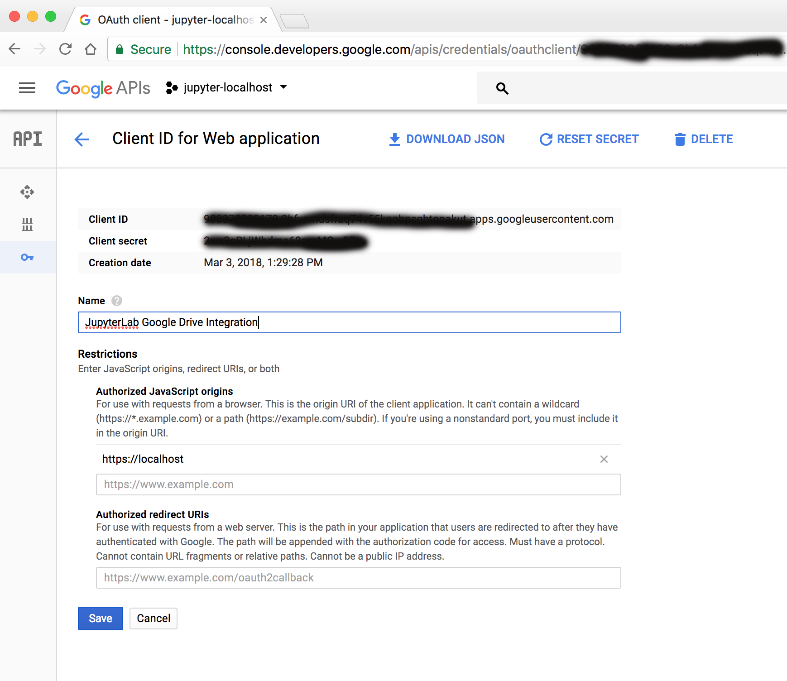

# Jupyterlab Google Drive Integration

Please follow the instructions here:
https://github.com/jupyterlab/jupyterlab-google-drive/blob/master/docs/advanced.md

These instructions will help you obtain your Google Client ID as in the figure below.

After you obtain Google API credentials, rename the file `drive.jupyterlab-settings-template` in the `singleuser` folder by removing the `-template` suffix, then update the file by filling upthe empty string "" in "clientId":"" with your Google Client ID (copy-paste from the developer console as above) . It's the long string with cryptic characters that end in `.apps.googleusercontent.com`.

> {
>
> "clientId":"paste-cryptic-google-client-id-here"  
>
> }
